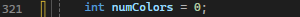

# Brian Peters 3 Artifacts ePortfolio

## Intorduction
I'm Brian Peters and I am an entry level software engineer with a bachelors. I specialize in C++, OpenGL, and MySQL for database. I am looking forward to work with OpenGL or DirectX coding since DirectX is commonly used and I have skills that can be transferrable from what I learn in OpenGL. I have three artifacts down below to show what I did step by step, and what are the goals. 

## Goal: 
The goal is to enhance the light shader in OpenGL, have it change colors manually for the first artifact, automatically change color and have a movement system in the second artifact, and third and last artifact is how to store obj file into mysql database

### Arifacts 1 - Software and Design Engineering and
### Artifact 2 - Algorthms and Data Structures are in the OpenGL

cs330 is the sln file to run the program which includes the module 6 folder. 

### Artifact 3 - Database

For the OBJ DDL file is the database to store OBJ files and the parse file is in the OBJ code folder

In the doc file, that will explain of what I have enhanced

### Artifact 1 – Software Design and Engineering

I created this in the lamp shader, so it goes into the vertex shader and out to the fragment shader.

(line 171)

 
 
Staying in the lamp shader, I added the integer “flip” where the function will be found through the vertex.

(Line 176)

 
Then connecting the “iflip” and “flip” 

(Line 182)

 
The next lines of code have the integer “iflip” flat in and which is now “flip” and “iflip” is connected and this is in the fragment shader source code

(Line 192)

 
Then the next part within the fragment shader source code, I took out the original and made if-else statements to have it change specific colors. 

(Line 195-211)

 
Then I made an integer “flip” of a value of one to have it where it has a certain value and for this case, I made it as one.

(Line 269)

 
And here is where it ties all together, which I stumbled on quite of bit. Flip + 1 % 5 is going to change five times and then start over. This is part of the functionality with the if-else statements. This is in the mouse button callback function

(Line 475)

 
Here's another part that I had a hard time with how this works. glUniformLocation is going to locate the lamp program and the “flip function. Next is to set up the vertex shaders

 
After all that, the lamp can change colors. With this process, there was a lot of learning just because of enhancing code as your project.
 
### Artifact 2 – Algorithms and Data Structure

To recap what I will be reusing is the color change if-else code

(Line 203-219)

 
Then I created a Boolean “flipActive” that equaled to false. This was created when I made another if-else to incorporate it into whether the loop was active.

 
Next, I added the double elapse to work with the delta time and it’s equal to zero as a starting point.

 
On line 328, elapse is equal to delta time, and what the variable is to the delta time that is currently equal to will add to the elapse as the same variable. (+=)

 
After that, I set up elapse greater than 1. Flip = flip +1 will just add one as a variable. % 5 will allow it to go five times. Then elapse equal to 0 would start it over in the code. Lastly, the flipActive is added to the loop.

(Line 329-332)

 
Then I set the integer of the number of colors

 
Then I set the loop up for the number of colors equal to 5 which is the number of colors I set up and made the flipActive equal to false to stop after the cycle. Then had the number of colors equal to 0 to go back to the starting point.

(Line 334-336)

 
 And finally, add flipActive under the right-click mouse button code and equal it to true. 

(Line 514)

 
I also decided to add movement of the light and see if I could figure out a way to do so and I did! Here’s the code for that 

 
 
### Artifact 3 – Database

This one was a complete overhaul after instructor feedback. The plan was to store data of the object file in the database system. To start, I created a database called “obj_data” and made tables of vertices, textures, normals, and faces. The vertices contain x, y, and z values and they were a float that way they could contain a decimal point. Textures had u and v as float. Normals had nx, ny, and nz as floats. Lastly, faces had indices of vertex, texture, and normals by using varchar or as in storing text at 255 for the maximum. After that, I created a DDL for the database – 

 
The reason why I stored these in tables like this is because when you look into the obj file in Notepad++, you see the textures normals, etc. Here what I see (part of) for the lamp

 
Then after speaking to a tutor about what I needed to do next, I needed to parse it. I created an OBJLoader.cpp file with tutorials help from YouTube videos and from the tutor. I had to prefix the “v”, “vn”, etc.

 
Then I created a OBJLoader.h file which I have done before. This way is to struct the values which defines them.

 
Lastly, I created the OBJ_Database.cpp to put it all together. The part that kind of concerns me is security features.

## Showcase Video

Watch Video for the showcase of the OpenGL

